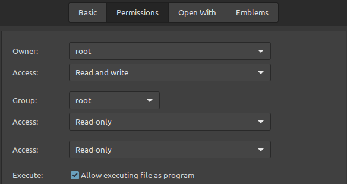
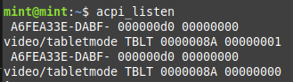

# Linux Mint acpi tablet mode
Laptop auto turn on/off onscreen keyboard app "onboard"

# Installation:
* Copy ./acpi contents in your linux mint /etc/acpi/ folder
* Make sure the .sh file has execute permissions
  
* run `sudo systemctl restart acpid.service` to restart the service

# References
* https://linuxconfig.org/how-to-handle-acpi-events-on-linux
* https://super-unix.com/ubuntu/ubuntu-how-to-disable-the-touchpad-when-the-lid-is-twisted-or-closed/
* https://discuss.getsol.us/d/690-onboard-detecting-tablet-mode/2
* https://stackoverflow.com/questions/13338870/what-does-at-the-end-of-a-linux-command-mean
* https://www.explainshell.com/explain?cmd=sudo+-i


# screenshots


cli output when moving the lid past 180 degrees and back
```console
mint@mint:~$ acpi_listen
 A6FEA33E-DABF- 000000d0 00000000
video/tabletmode TBLT 0000008A 00000001
 A6FEA33E-DABF- 000000d0 00000000
video/tabletmode TBLT 0000008A 00000000
```
